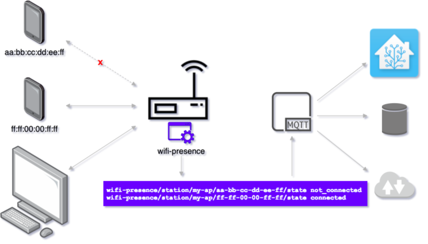

# wifi-presence  [](https://pkg.go.dev/github.com/awilliams/wifi-presence)

Presence detection on OpenWrt routers using connect/disconnect events of WiFi clients. Events are published to MQTT with Home Assistant integration.

* **What**: Standalone application that runs on OpenWrt access points.
Publishes WiFi client connect and disconnect events to an MQTT broker.
* **Why**: Presence detection for home automation systems. Integrates with Home Assistant using the [MQTT](https://www.home-assistant.io/integrations/device_tracker.mqtt/) integration.
* **How**: `wifi-presence` connects to [`hostapd`'s control interface](http://w1.fi/wpa_supplicant/devel/hostapd_ctrl_iface_page.html) to receive client connect and disconnect events.

Requirements:
 * Supported system running [hostapd](http://w1.fi/hostapd/) (such as an OpenWrt AP)
 * MQTT broker

**Contents**:
 * [Quickstart](#quickstart)
 * [Motivation](#motivation)
 * [Home Assistant](#home-assistant)
 * [Configuration](#configuration)
   * [JSON via MQTT](#json-via-mqtt)
 * [OpenWrt](#openwrt)
   * [opkg](#opkg)
   * [Download](#download)
 * [Flags](#flags)
 * [MQTT](#mqtt)
 * [hostapd](#hostapd)
   * [hostapd full version](#hostapd-full-version)
 * [iOS](#ios) (randomized MAC addresses)
 * [OpenWrt Luci Integration](#openwrt-luci-integration)



## Quickstart

1. Install `wifi-presence` on an OpenWrt access point. See [okpg](#opkg) or [download](#download).
2. Update the `/etc/config/wifi-presence` configuration file. Update the `mqttAddr` to the desired MQTT broker's address.
3. Publish to the `wifi-presence/config` topic a list of MAC addresses to track. See [configuration](#configuration).

If using Home Assistant with the same MQTT broker, it should automatically be updated with each configured WiFi client.

## Motivation

A home automation system that reacts to presence and absence events provides a more automated experience.

There are many ways to determine presence, e.g. motion sensors, network traffic monitoring, GPS & geo-fencing, etc.
A person's phone typically travels with them in and out of a household.
Most phones automatically connect and disconnect from home WiFi networks.
Therefore a WiFi connection to one or more access points (APs) can be used as a proxy for physical presence.

There are similar projects that periodically ping client devices.
This method may be less reliable than using `hostapd` because phones may not respond to pings while in low power mode.
There is also a delay introduced by the ping frequency.

## Home Assistant

wifi-presence integrates with Home Assistant using the [MQTT](https://www.home-assistant.io/integrations/device_tracker.mqtt/) integration.
This can be enabled/disabled via the `-hass.autodiscovery` flag (true by default).

Although supported, Home Assistant isn't required.
The messages published to MQTT can be consumed by any subscriber(s).

## Configuration

Configuration is done via command-line flags at startup, and via MQTT at runtime.

The MQTT configuration determines the WiFi devices/clients wifi-presence will monitor.
For each configured device, wifi-presence will publish state information on connect and disconnect.
See the note about [iOS](#iOS) devices and MAC addresses.

### JSON via MQTT

Configuration is a JSON published to the config topic (`<mqtt.prefix>/config`).

Example configuration:
```json
{
  "devices": [
    {
      "name": "My Phone",
      "mac": "AA:BB:CC:DD:EE:FF"
    },
    {
      "name": "TV",
      "mac": "00:11:22:33:44:55"
    },
    {
      "name": "Other Phone",
      "mac": "FF:EE:EE:DD:CC:BB"
    }
  ]
}
```

Example using [Mosquitto](https://mosquitto.org) to the JSON configuration in `wifi-presence.config.json`:
```shell
$ mosquitto_pub \
        -h 'my-mqtt-broker' \
        -t 'wifi-presence/config' \
        -r \
        -f wifi-presence.config.json
```

## OpenWrt

The [OpenWrt](https://openwrt.org/about) project is
> OpenWrt is a highly extensible GNU/Linux distribution for embedded devices (typically wireless routers).

See the [openwrt](https://github.com/awilliams/wifi-presence/tree/openwrt) branch for package and build scripts.

### opkg

Installation via OpenWrt's `opkg` package manager:

```shell
# Add public key
wget https://wifi-presence.s3.us-east-2.amazonaws.com/public.key
opkg-key add public.key

# Add package source as a custom feed
echo "src/gz wifi-presence http://wifi-presence.s3-website.us-east-2.amazonaws.com" >> /etc/opkg/customfeeds.conf

# Fetch/update list of packages
opkg update

# Install/upgrade wifi-presence
opkg install wifi-presence

# Update configuration
vim /etc/config/wifi-presence

# Enable and start wifi-presence
/etc/init.d/wifi-presence enable
```

### Configuration

The configuration file is: `/etc/config/wifi-presence`.

### Download

OpenWrt packages of `wifi-presence` are available for [download](https://github.com/awilliams/wifi-presence/releases/latest).

## Flags

When running `wifi-presence` using OpenWrt, use the provided `/etc/config/wifi-presence` file to configure.

As a standalone program, the following command-line flags are used:
```
wifi-presence [options]

Options:
  -apName string
    	Access point name (default "my-router")
  -debounce duration
    	Time to wait until considering a station disconnected. Examples: 5s, 1m (default 10s)
  -hass.autodiscovery
    	Enable Home Assistant MQTT autodiscovery (default true)
  -hass.prefix string
    	Home Assistant MQTT topic prefix (default "homeassistant")
  -help
    	Print detailed help message
  -hostapd.socks string
    	Hostapd control interface socket(s). Separate multiple paths by ':'
  -mqtt.addr string
    	MQTT broker address, e.g "tcp://mqtt.broker:1883"
  -mqtt.id string
    	MQTT client ID (default "wifi-presence.my-router")
  -mqtt.password string
    	MQTT password (optional)
  -mqtt.prefix string
    	MQTT topic prefix (default "wifi-presence")
  -mqtt.username string
    	MQTT username (optional)
  -sockDir string
    	Directory for local socket(s) (default "/var/folders/99/0z1nqy2d54x12xj2md6xz67w0000gn/T/")
  -v	Verbose logging (alias)
  -verbose
    	Verbose logging
  -version
    	Print version and exit
```

## MQTT

wifi-presence publishes and subscribes to an MQTT broker.
The -mqtt.prefix flag can be used to change the topic prefix,
along with -hass.prefix for Home Assistant's topic prefix.

The following topics are used:

  * `<PREFIX>/<AP_NAME>/status`
  The status of wifi-presence (online / offline).

  * `<PREFIX>/config`
  wifi-presence subscribes to this topic for configuration updates.

  * `<HASS_PREFIX>/device_tracker/<AP_NAME>/<MAC>/config`
  If -hass.autodiscovery is enabled, then all configured devices will be published
  to these topics (based on their MAC address). Home Assistant subscribes to these
  topics and registers/unregisters entities accordingly based on messages received.

  * `<PREFIX>/station/<AP_NAME>/<MAC>/state`
  The state of a device (home / not_home) is published to these topics.

  * `<PREFIX>/station/<AP_NAME>/<MAC>/attrs`
  A JSON object with device attributes (SSID, BSSID, etc) is published to these topics.

## hostapd

wifi-presence requires hostapd running with control interface(s) enabled.
This is the default for OpenWrt.
The hostapd configuration option is `ctrl_interface`. More information:
https://w1.fi/cgit/hostap/plain/hostapd/hostapd.conf

The wifi-presence -hostapd.socks option should correspond to the socket
locations defined by 'ctrl_interface'. Multiple sockets can be monitored
(one socket per radio is created by hostapd).

#### hostapd full version

OpenWrt includes a stripped down version of hostapd, which is the default.
This stripped down version is compatible with wifi-presence, but prevents wifi-presence from getting a list of connected devices at startup.
In this case, all devices will be considered "disconnected" until a (re)-connect is seen.

The full version of hostapd can be installed to improve wifi-presence.
When using the full version, wifi-presence will query hostapd for a list of connected devices at startup/when receiving new configuration.
Any connected stations will immediately be considered "connected", triggering a corresponding MQTT message for each.

The full version is included as part of various packages. For example, commands to install the full version using `wpad`:

```shell
opkg remove wpad-basic-mbedtls
opkg install wpad-mbedtls
```

## iOS

iOS version 14 introduced ["private Wi-Fi addresses"](https://support.apple.com/en-us/HT211227) to improve privacy.
When enabled, an iOS client will connect to APs using different MAC addresses. Consider disabling this feature for APs that
you control and are running `wifi-presence` to help make presence detection configuration easier.

## Alternatives: OpenWrt Luci Integration

The [OpenWrt Luci](https://www.home-assistant.io/integrations/luci/) integration similar presence detection functionality.

Some differences between `wifi-presence` and the `luci` integration:
 * The `luci` integration communicates with the OpenWrt router using the OpenWrt admin HTTP(S) interface, while `wifi-presence` uses MQTT.
 The MQTT HomeAssistant integration is then what bridges the two.
 There's not necessarily an advantage to either approach, although if you don't have MQTT already integrated, then `wifi-presence` may not make as much sense.

 * Presence Detection:
   * The `luci` integration uses polling, i.e. it periodically queries the OpenWrt interface for the list of connected clients, while `wifi-presence` is event-driven.
   It connects with OpenWrt's hostapd (the system responsible for WiFi) and receives connect/disconnect events in real-time.
   * The `luci` integration effectively scrapes the [ARP and DHCP tables](https://github.com/fbradyirl/openwrt-luci-rpc/blob/9eb3a2bea5ddad93877dbe3bf4f6d189391a9fa7/openwrt_luci_rpc/openwrt_luci_rpc.py#L161-L162) on the OpenWrt router to get a list of connected clients.
   While `wifi-presence` is integrated directly with hostapd and has direct access to the connected clients.
